🇪🇸 Español | us English](README.en.md)

# Análisis de Correlación y Dashboard Ejecutivo - Global Electronics Retailer

## 1.0 Resumen del Proyecto

En este proyecto se presenta un análisis de correlación aplicado a Global Electronics Retailer, con foco principal en la relación entre el tamaño de las tiendas físicas y sus ventas totales, complementado con un análisis de regresión para identificar tiendas que superan o quedan por debajo de su rendimiento esperado. El análisis se amplía con una segmentación de clientes por gasto total, que reveló que el 25% de clientes que más gasta genera el 62.7% de los ingresos totales de la empresa.

Las herramientas utilizadas fueron SQL Server, para el análisis exploratorio (EDA) la limpieza,modelado de datos y las consultas de negocio; y Power BI, para la construcción del modelo de datos, el cálculo de medidas con DAX y la visualización final de los hallazgos en un dashboard ejecutivo interactivo.

## 2.0 Problema de Negocio

La empresa Global Electronics Retailer es una cadena minorista de electrónica de consumo, con presencia en ocho países (Estados Unidos, Reino Unido, Alemania, Francia, Canadá, Australia, Italia y Países Bajos) a través de tiendas físicas y un canal de venta en línea. Su catálogo abarca categorías como audio, cámaras, celulares, computadoras, videojuegos y juguetes, electrodomésticos, entretenimiento (música, películas y libros), y televisores.

Ante una operación distribuida en múltiples países y canales, la dirección de la empresa necesita identificar qué factores se relacionan con el desempeño de ventas a nivel de tienda y de cliente para orientar decisiones sobre distrubución efectiva de tiendas físicas e identificar oportunidades de mejora.

## 3.0 Hipótesis

H1 - Margen vs. Cantidad vendida: se esperaba encontrar una relación entre el margen unitario de un producto y la cantidad de unidades vendidas, bajo la premisa de que productos con menor margen (más económicos) tienden a venderse en mayor volumen.

H2 - Edad del cliente vs. Gasto total: se esperaba que la edad del cliente tuviera algún grado de relación con su gasto total acumulado.

H3 - Tamaño de tienda vs. Ventas totales: se esperaba que las tiendas físicas de mayor tamaño (en metros cuadrados) generaran mayores ventas totales, bajo la premisa de que más espacio permite exhibir más inventario y atender más clientes.

## 4.0 Fuente de Datos

El dataset utilizado es "Global Electronics Retailer" disponible de forma gratuita en Maven Analytics Data Playground. Está compuesto por 5 tablas relacionales: Customers (15,266 filas), Products (2,517 filas), Stores (66 filas), Sales (62,884 filas) y Exchange_Rates (11,215 filas) cubriendo transacciones desde enero de 2016 hasta febrero de 2021.

La tabla Exchange_Rates fue descartada del análisis: dado que las columnas Unit_Cost_USD y Unit_Price_USD de la tabla Products ya se encuentran estandarizadas en dólares estadounidenses, todo el análisis se desarrolló en USD sin necesidad de utilizar conversión de moneda.

## 5.0 Herramientas Utilizadas

* SQL Server / SSMS — modelado de base de datos, análisis exploratorio (EDA), consultas de negocio y cálculo de correlación/regresión.
* Power BI Desktop — modelado de datos, medidas DAX, construcción del dashboard ejecutivo.
* Visual Studio Code — documentación del proyecto en Markdown.
* GitHub — control de versiones y publicación del portafolio.

## 6.0 Metodología

El proyecto se inició con la importación de las 5 tablas del dataset a SQL Server y la definición del modelo de datos: se establecieron llaves primarias (simples y compuestas, según el caso) y llaves foráneas entre Sales y sus tablas de dimensión (Customers, Products, Stores), incluyendo la incorporación de un registro "Online" en Stores para representar las ventas sin tienda física asociada.

El análisis principal se enfocó en seleccionar variables numéricas relevantes para calcular el coeficiente de correlación de Pearson entre ellas, evaluando la fuerza y dirección de su relación. La elección de estas variables surgió del análisis exploratorio (EDA) realizado sobre todas las tablas involucradas, en el contexto del negocio.

La comprobación de las dos primeras hipótesis no arrojó una correlación relevante, por lo que no se profundizó más allá de documentar el resultado. La tercera hipótesis sí mostró una correlación moderada, lo que dio paso a un análisis más profundo mediante regresión lineal, permitiendo predecir las ventas esperadas de una tienda según su tamaño y clasificarlas según su desempeño real frente a esa predicción.

Para enriquecer el análisis y el dashboard se calcularon KPI's relevantes para la organización: ingresos totales, margen total, ticket promedio, ventas promedio por tienda, así como una segmentación de clientes por cuartil de gasto y el running total de ingresos y margen a lo largo del tiempo.

Finalizada la etapa de consultas en SQL Server, las tablas y vistas resultantes se exportaron a Power BI para el modelado de datos, la construcción de medidas en DAX y la visualización final. Cada medida clave (KPIs, correlaciones) fue validada comparando su resultado en Power BI contra el valor obtenido directamente en SQL Server, confirmando consistencia entre ambas herramientas.

## 7.0 Preguntas de Negocio y Hallazgos

### 7.1 ¿Existe relación entre el margen de un producto y la cantidad vendida?

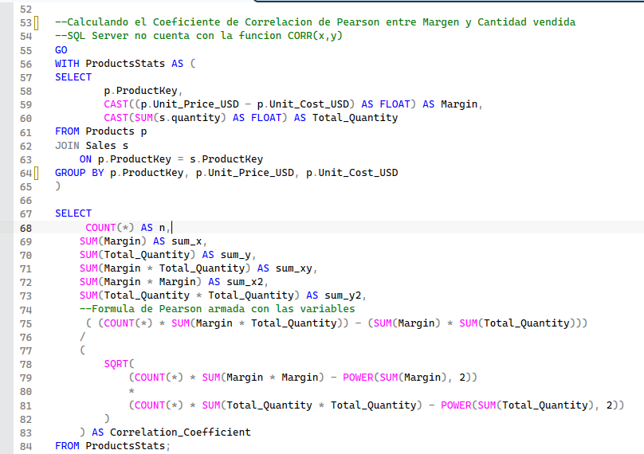

### 7.1.1 Resultado

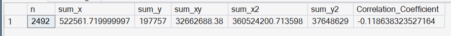

### 7.1.2 Hallazgo

EL resultado R negativo (-0.1186) nos indica que en promedio a mayor margen hay una ligera cantidad menos vendida y viceversa. Segun la escala de interpretacion del coeficiente: (0-0.3) débil, (0.3-0.7) moderada y (0.7-1) fuerte entonces con 0.1186 cae en el rango de coeficiente débil sería prácticamente casi nula.

En conclusión: el margen de un producto no tiene una relación confiable con su volumen de ventas, no se puede usar el margen para predecir si algo se va a vender mucho o poco.

Aplicando el coeficiente de determinacion (R^2) = (-0.1186)² = 0.014 explica el margen 1.4 % de la variación en las unidades vendidas mientras que el 98.6% se debe a otros factores como categoría, marca, necesidad del producto, temporada, etc.

### 7.2 ¿Existe relación entre la edad del cliente y su gasto total?

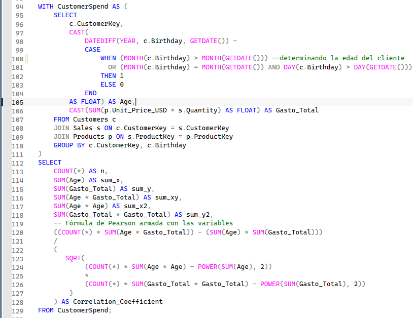

### 7.2.1 Resultado

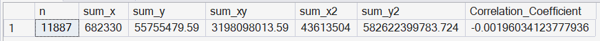

### 7.2.2 Hallazgo

El resultado (R = -0.0019) indica una correlación prácticamente nula entre la edad del cliente y su gasto total, el valor está tan cerca de cero que no existe ninguna relación lineal identificable entre ambas variables. De hecho, es una correlación aún más débil que la encontrada entre margen y cantidad vendida.

En conclusión: la edad del cliente no es un factor que explique o prediga cuanto gasta en la empresa. Clientes de distintas edades gastan de forma similar, en promedio el gasto total parece depender de otros factores no explorados en esta hipótesis (frecuencia de compra, categoría de producto preferida, ubicación geográfica, entre otros).

### 7.3 ¿El tamaño de una tienda física se relaciona con sus ventas totales?

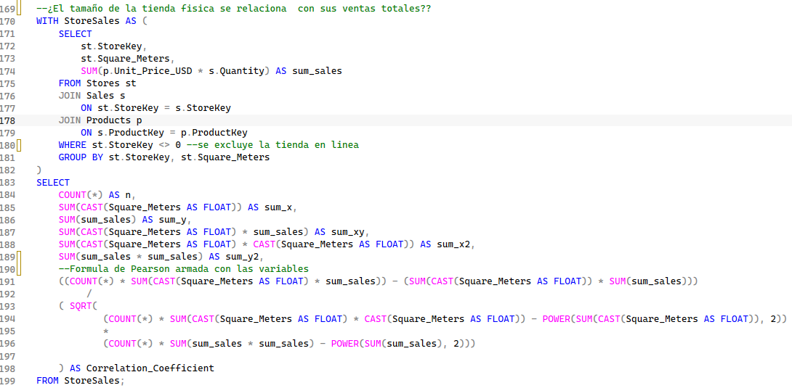

### 7.3.1 Resultado

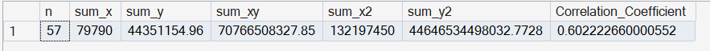

### 7.3.2 Hallazgo

El resultado para esta correlación fue de R = 0.6022, lo que, según la escala de interpretación utilizada, se ubica en el rango moderado. Al ser positivo, se puede afirmar que existe una relación directa entre las variables: a mayor tamaño de tienda (m²) mayor tiende a ser su volumen de ventas totales.

Aplicando el coeficiente de determinación R² = (0.6022)² = 0.3626 el tamaño de la tienda explica aproximadamente el 36.3% de la variación en las ventas totales. El 63.7% restante depende de otros factores no incluidos en este análisis, como: ubicación, tráfico de clientes o combinación de productos.

En conclusión: a diferencia de las dos hipótesis anteriores, el tamaño de tienda sí muestra una relación real con el desempeño de ventas, aunque no la explica por completo. Este resultado, junto con el hecho de que el análisis se calculó sobre una muestra de apenas 57 tiendas, motivó a profundizar el hallazgo mediante un análisis de regresión lineal (ver siguiente pregunta) para identificar que tiendas específicas se alejan de este patrón esperado.

### 7.4 ¿Qué tiendas superan o quedan por debajo del rendimiento esperado según su tamaño?

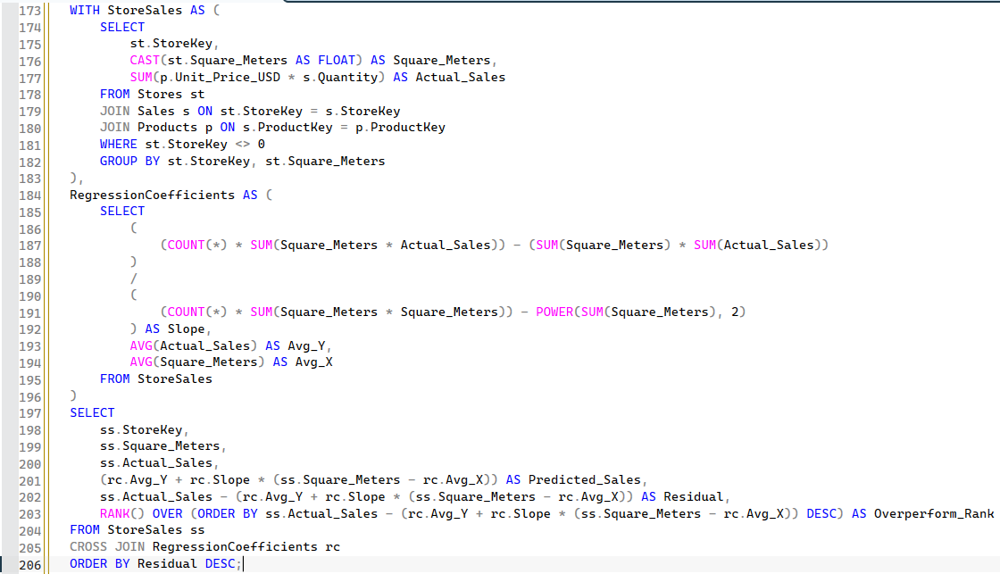

### 7.4.1 Resultado

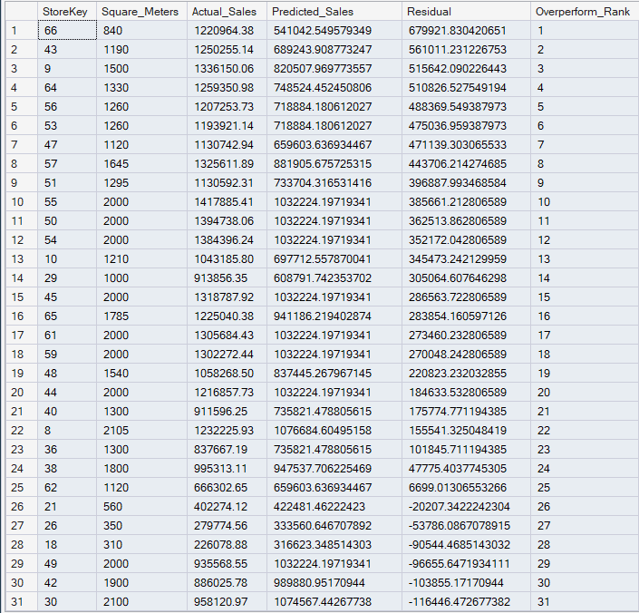 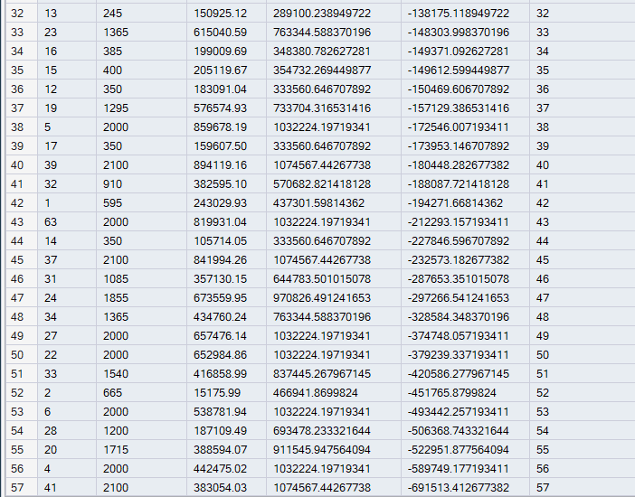

### 7.4.2 Hallazgo

A partir de la correlación moderada encontrada entre tamaño de tienda y ventas (R = 0.6022) se aplicó un análisis de regresión lineal simple para estimar la venta esperada de cada tienda según su tamaño, calculando la pendiente e intercepto de la recta de mejor ajuste directamente en SQL Server. Con esa predicción, se calculó el residuo de cada tienda (venta real menos venta esperada) y se utilizó la función de ventana RANK() para ordenarlas de mayor a menor sobre-rendimiento.

El hallazgo más relevante: una tienda de apenas 840 m² generó ventas reales de $1,220,964 esto muy por encima de los $541,042 que su tamaño predecía, más del doble de lo esperado. En el extremo opuesto, se identificaron tiendas de mayor tamaño con ventas por debajo de su predicción, lo que sugiere que factores distintos al tamaño físico (ubicación, gestión, combinación de productos) están influyendo fuertemente en su desempeño.

En conclusión: el tamaño de tienda por sí solo no garantiza un buen desempeño de ventas. Identificar tiendas que superan su predicción permite a la empresa investigar qué prácticas replicar en otras ubicaciones, por ejemplo: identificar las tiendas que quedan por debajo de lo esperado, permite priorizar intervenciones de mejora continua.

### 7.5 ¿Qué concentración de ingresos representa el segmento de clientes que más gasta?

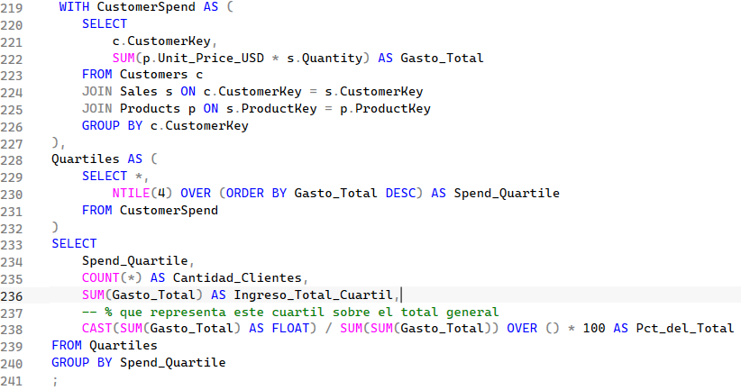

### 7.5.1 Resultado

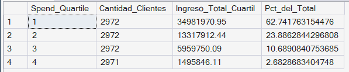

### 7.5.2 Hallazgo

Se segmentó a los clientes en 4 cuartiles según su gasto total acumulado, utilizando la función de ventana NTILE(4). El cuartil 1 (25% de clientes que más gasta) generó $34,981,970.95, equivalente al 62.74% de los ingresos totales de la empresa (más de 6 de cada 10 dólares). En el extremo opuesto, el cuartil 4 (25% que menos gasta) representó apenas el 2.68% de los ingresos.

Esta concentración es incluso más marcada que el clásico principio 80/20: en este caso, un cuarto de los clientes genera casi las dos terceras partes del ingreso total de la compañía.

En conclusión: la base de clientes no contribuye de forma pareja a los ingresos, existe una dependencia fuerte en un segmento reducido de clientes de alto valor. Perder una porción del cuartil 1 tendría un impacto financiero desproporcionadamente alto comparado con perder clientes de los cuartiles inferiores, lo que sugiere que las estrategias de retención deberían priorizar a este grupo por encima de la adquisición de nuevos clientes.

## 8.0 Visualización del Dashboard

### Página 1 — Resumen Ejecutivo

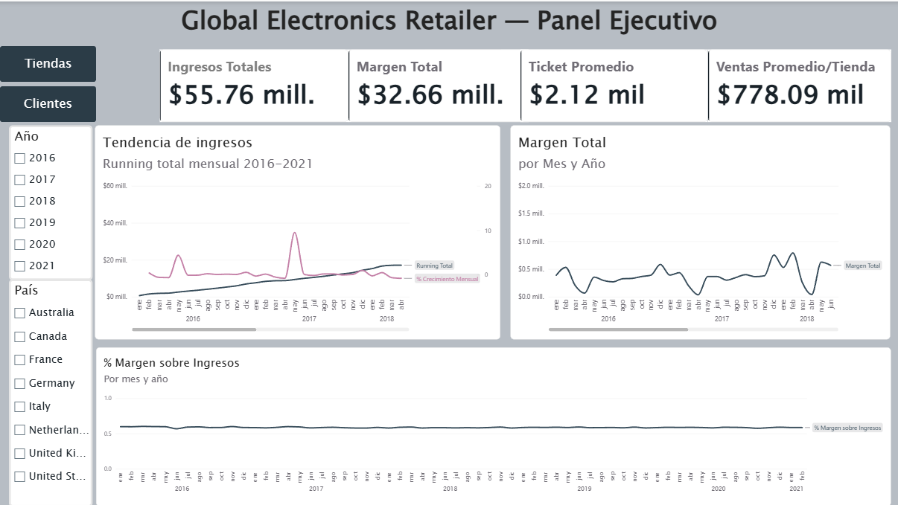

Presenta los 4 KPIs principales de la organización (Ingresos Totales, Margen Total, Ticket Promedio, Ventas Promedio por Tienda), la tendencia mensual de ingresos con running total, la evolución del margen, y el % de margen sobre ingresos a lo largo del tiempo. Es filtrable por Año y País.

En la tendencia de ingresos se observan picos marcados de crecimiento mensual coincidiendo con diciembre/enero de cada año, sugiriendo estacionalidad ligada a temporada de fin de año. Por otro lado, el % de margen sobre ingresos se mantiene notablemente estable (entre 58% y 59%) durante los 6 años del dataset, a pesar de las fuertes fluctuaciones estacionales en ingresos absolutos lo que indica que la rentabilidad de la empresa es consistente independientemente del volumen de ventas de cada mes.

### Página 2 — Análisis de Tiendas

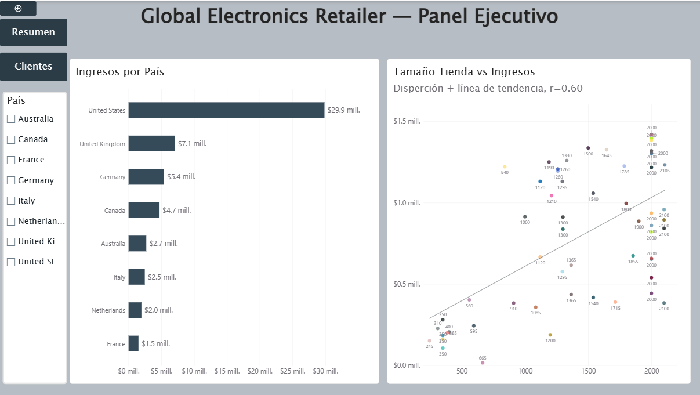

Muestra el hallazgo principal de correlación (tamaño de tienda vs. ingresos con línea de tendencia) junto a un desglose de ingresos por país. Es filtrable por País.

### Página 3 — Análisis de Clientes

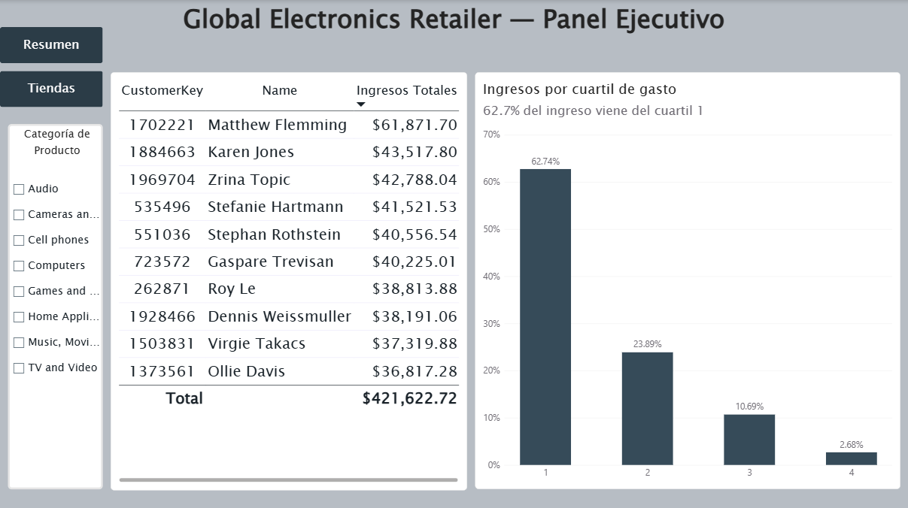

Presenta la concentración de ingresos por cuartil de gasto, junto con una tabla de los 10 clientes de mayor gasto total. Es filtrable por Categoría de Producto.

## 9.0 Recomendaciones de Negocio

Al equipo de Expansión y Operaciones de Tienda:

1. Si bien se confirmó una relación moderada entre el tamaño de una tienda y sus ventas totales (R = 0.6022) este factor por sí sólo explica el 36% de esa variación, por lo tanto, no se recomienda basar decisiones de expansión o inversión únicamente en el tamaño físico de una tienda. El tamaño debe considerarse como un factor entre varios, no como predictor único del éxito de una ubicación.

2. Se recomienda realizar un análisis operativo detallado de las tiendas identificadas con mayor sobre-rendimiento frente a su tamaño (el caso más notable: una tienda de 840 m² con ventas más del doble de lo esperado). Este análisis debería incluir el flujo de ventas, combinación de productos vendidos, volumen de transacciones y perfil de los clientes que compran en esas ubicaciones, con el objetivo de identificar prácticas replicables en tiendas de tamaño similar con desempeño por debajo de lo esperado.

Al equipo de Retención de Clientes y Marketing:

3. El 25% de clientes que más gasta genera el 62.74% de los ingresos totales de la empresa, mientras que el 25% que menos gasta apenas representa el 2.68%. Dada esta alta concentración, se recomienda priorizar los recursos de retención y fidelización (programas de lealtad, atención personalizada, ofertas dirigidas) en el segmento de mayor gasto (cuartil 1) por encima de estratégias de adquisición de nuevos clientes, perder una fracción de este grupo tendría un impacto financiero desproporcionadamente mayor que perder clientes de los cuartiles inferiores. Se recomienda además investigar qué características comparten los clientes de este segmento (categorías de producto preferidas, frecuencia de compra, canal de compra) para replicar ese perfil en campañas de adquisición.

## 10.0 Limitaciones y Próximos Pasos

Limitaciones

* El análisis de margen vs. cantidad vendida excluyó 25 productos sin ninguna venta registrada, ya que no aportan información a la relación estudiada; esta exclusión fue una decisión consciente, no un descarte accidental.
* El análisis de regresión y ranking de tiendas se calculó sobre una muestra de solo 57 tiendas físicas, lo que hace que el resultado sea sensible a valores atípicos individuales.
* La validación del supuesto de linealidad de Pearson se realizó de forma visual (mediante scatter plot) no a través de una prueba estadística formal; tampoco se evaluó el supuesto de normalidad de las variables.
* El análisis se desarrolló exclusivamente en USD ya que las columnas de costo y precio del dataset ya venían estandarizadas en esa moneda; la tabla Exchange_Rates fue descartada del análisis por no ser necesaria bajo este alcance.
* Se identificó que el 79% de las órdenes no tienen fecha de entrega registrada, correspondiendo a compras retiradas directamente en tienda física en lugar de envíos a domicilio; este patrón se documenta como hallazgo del EDA, pero no se investigó a profundidad al estar fuera del alcance de este proyecto.
* Las hipótesis de margen vs. cantidad y edad vs. gasto no mostraron relación relevante, pero no se investigaron variables alternativas que pudieran explicar mejor esos comportamientos (categoría de producto, frecuencia de compra, canal de venta).

Próximos Pasos

* Explorar qué variables explican mejor el volumen de ventas por producto y el gasto por cliente, dado que margen y edad no resultaron relevantes.
* Ampliar el análisis de regresión de tiendas incorporando variables adicionales (ubicación, antigüedad de la tienda) más allá del tamaño físico.
* Profundizar la segmentación de clientes con un modelo RFM completo (Recencia, Frecuencia y Monetario), en lugar de segmentar únicamente por gasto total.
* Aplicar los aprendizajes de este proyecto a los próximos dos proyectos de portafolio planeados, enfocados en limpieza de datos y modelado de datos (identificación de entidades y tablas).

## 11.0 Estructura del Repositorio

| Carpeta/Archivo | Descripción |
|---|---|
| `sql/` | Scripts de SQL Server: creación de base de datos, modelado (PK/FK), vistas, consultas de correlación, regresión y KPIs |
| `powerbi/` | Archivo `.pbix` del dashboard ejecutivo |
| `images/` | Capturas de resultados de SQL y del dashboard, utilizadas en este README |
| `data/` | Archivo `.md` con el enlace al dataset original en Maven Analytics (no se incluye el CSV por su tamaño) |
| `README.md` | Este documento |

👤 Autora

Monica Chicas — Analista de Datos | Ingeniera Industrial

[LinkedIn](https://www.linkedin.com/in/monica-chicas-6132913bb/) · [GitHub](https://github.com/monikchicas)
